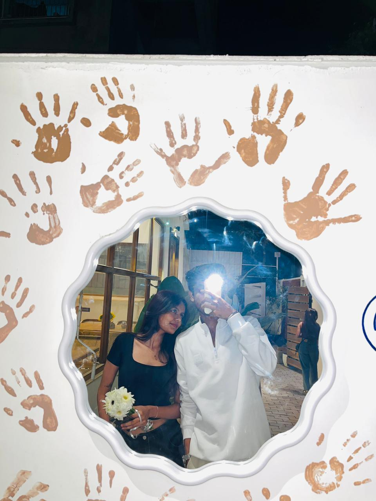
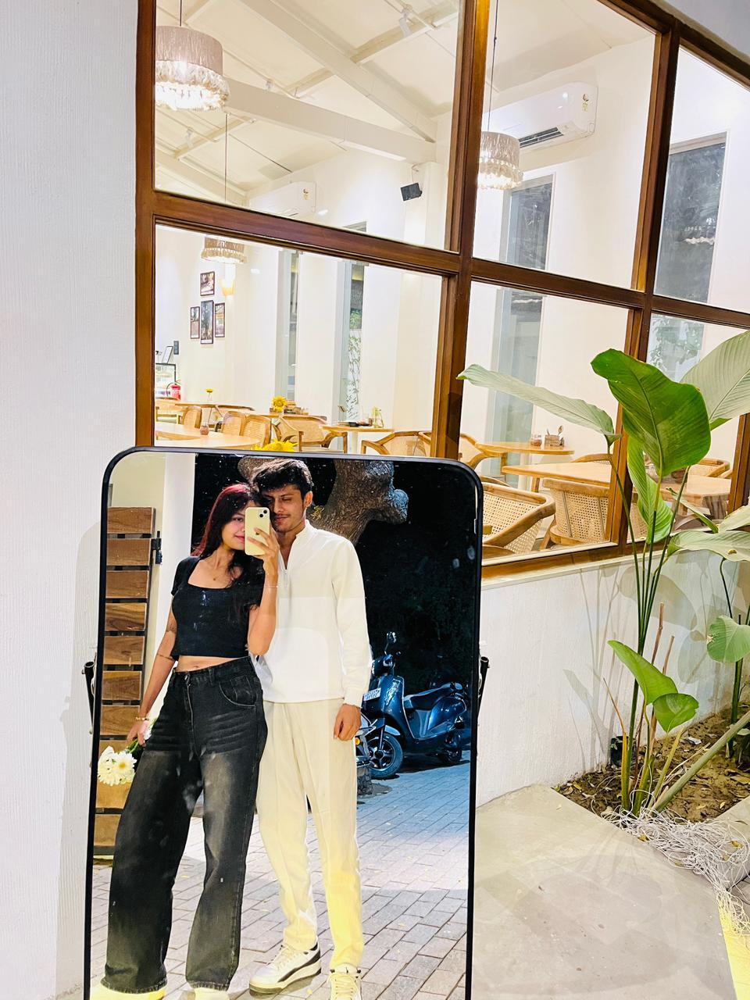
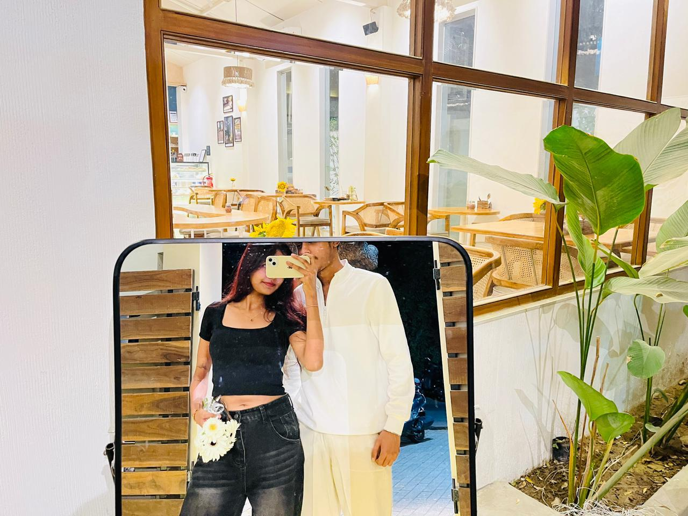

<!DOCTYPE html>
<html lang="en">
<head>
<meta charset="UTF-8">
<meta name="viewport" content="width=device-width, initial-scale=1.0">
<title>Just a Small Effort ❤️</title>

</head>

<body>

<audio autoplay loop>
    <source src="https://cdn.pixabay.com/download/audio/2022/03/15/audio_5f5b0b4a28.mp3?filename=romantic-background-112191.mp3" type="audio/mpeg">
</audio>

<section>
    <h1>Hey, My Cutuuu ❤️</h1>
    

        The way you smile makes my worst days disappear.
        The way you talk feels like my favorite song on repeat.
        And the way you simply exist… it makes my world softer, sweeter, and so much more beautiful.
        You didn’t just change my life you became the best part of it. 💕
    

    <button onclick="nextPage()">Next ➜</button>
    <button onclick="playMusic()">Play Our Song 🎵</button>
</section>

<section style="background: rgba(0,0,0,0.2);">
    <h1>Our Only moments 📸</h1>
    

        
        
        
    

    

        Every memory with you is becoming my favorite chapter.
        This picture isn’t just a photo… it’s proof that my happiest place is right beside you.
    

    <button onclick="nextPage()">Next ➜</button>
</section>

<!-- Lightbox -->

    

<section>
    <h1>What You Mean To Me 💖</h1>
    

        You are my peace on chaotic days.
        My smile without reason.
        My comfort, my heart.
        And today, I want to make something official…
    

    <button onclick="nextPage()">Next ➜</button>
</section>

<section style="background: rgba(0,0,0,0.3);">
    <h1>So Will You Be My Valentine? 💍</h1>
    

        Not just for a day.
        But for every sunrise, every laugh,
        and every beautiful moment we haven’t lived yet.
    

    <button onclick="sayYes()">Yes, Always ❤️</button>
    <button id="noBtn">No 🙈</button>
    <h2 id="finalMessage"></h2>
</section>

</body>
</html>
